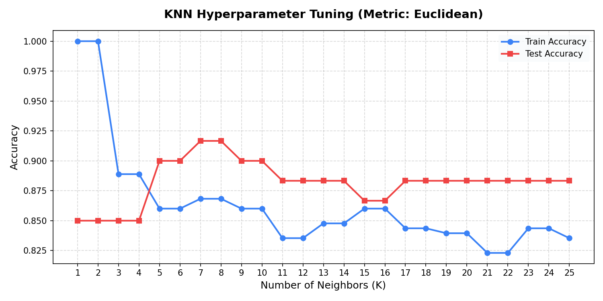
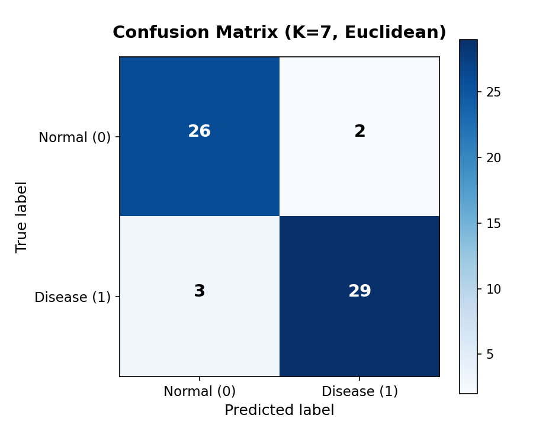

# K-Nearest Neighbors (KNN) Classifier — From Scratch

> **BSc. Data Science | Machine Learning Assignment**  
> **Student ID:** 2406645  
> **Dataset:** UCI / Kaggle Heart Disease Dataset  

---

## Overview

This project implements the **K-Nearest Neighbors (KNN)** classification algorithm entirely from scratch using Python and NumPy — without relying on scikit-learn's `KNeighborsClassifier` for the core algorithm.

The model is applied to the [UCI Cleveland Heart Disease dataset](https://www.kaggle.com/datasets/cherngs/heart-disease-cleveland-uci) to predict whether a patient has heart disease based on 13 clinical features.

---

## Project Structure

```
knn_assignment/
├── src/
│   ├── __init__.py
│   ├── knn.py           # KNN Classifier implementation from scratch
│   ├── preprocess.py    # Custom MinMaxScaler, StandardScaler & train_test_split
│   └── metrics.py       # Accuracy, Precision, Recall, F1-Score, Confusion Matrix
├── app.py               # Interactive Tkinter GUI dashboard
├── run_cli.py           # CLI evaluation & hyperparameter tuning script
├── notebook.ipynb       # Jupyter Notebook (theory + implementation walkthrough)
├── requirements.txt     # Required libraries
└── README.md
```

---

## Algorithm Implementation

### Distance Metrics (Implemented from Scratch)

| Metric | Formula |
|---|---|
| Euclidean | $d(u,v) = \sqrt{\sum (u_i - v_i)^2}$ |
| Manhattan | $d(u,v) = \sum \|u_i - v_i\|$ |
| Minkowski | $d(u,v) = \left(\sum \|u_i - v_i\|^p \right)^{1/p}$ |

### Custom Preprocessing

- `StandardScaler` — Z-score normalization (mean=0, std=1)
- `MinMaxScaler` — Min-Max normalization to [0,1]
- `train_test_split` — Random shuffled split without sklearn

### Custom Evaluation Metrics

- Accuracy, Precision, Recall, F1-Score, Confusion Matrix, Classification Report

---

## Results

| Configuration | Test Accuracy |
|---|---|
| K=7, Euclidean + StandardScaler | **91.67%** |
| K=5, Manhattan + StandardScaler | 88.33% |

**Comparison with Scikit-Learn:** Custom implementation predictions **match exactly** with `sklearn.neighbors.KNeighborsClassifier` using the same parameters.

---

## How to Run

### 1. Install dependencies
```bash
pip install -r requirements.txt
```

### 2. Run the CLI Evaluation (trains the model + generates plots)
```bash
python run_cli.py
```

### 3. Launch the Interactive GUI Dashboard
```bash
python app.py
```

### 4. Open the Jupyter Notebook
```bash
jupyter notebook notebook.ipynb
```

---

## Dataset

The **Heart Disease UCI dataset** contains **303 patient records** with **13 clinical features** and a binary target label:

| Feature | Description |
|---|---|
| `age` | Age in years |
| `sex` | Sex (1 = male, 0 = female) |
| `cp` | Chest pain type (0–3) |
| `trestbps` | Resting blood pressure (mm Hg) |
| `chol` | Serum cholesterol (mg/dl) |
| `fbs` | Fasting blood sugar > 120 mg/dl |
| `restecg` | Resting ECG results (0–2) |
| `thalach` | Max heart rate achieved |
| `exang` | Exercise induced angina |
| `oldpeak` | ST depression induced by exercise |
| `slope` | Slope of the peak exercise ST segment |
| `ca` | Number of major vessels colored by fluoroscopy |
| `thal` | Thalassemia type |
| `target` | **1 = Heart Disease, 0 = Normal** |

---

## Screenshots

### Hyperparameter Tuning (K vs Accuracy)


### Confusion Matrix (Best Model: K=7, Euclidean)

